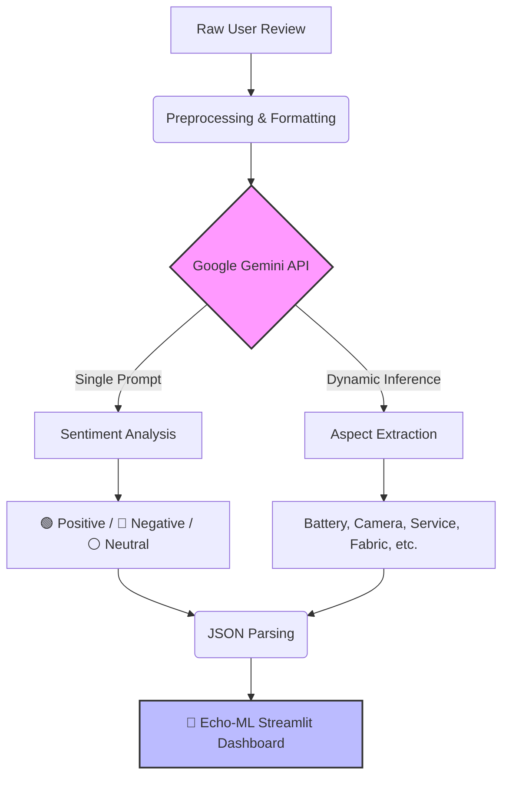

# 🚀 Echo-ML: Aspect-Based Sentiment Analysis

**Live Demo:** [Play with Echo-ML Here](https://echo-ml-ldaouvh4sbfwqdrgbnbvpu.streamlit.app/)

## 📌 Overview
Echo-ML is an intelligent web application designed to parse unstructured customer feedback and product reviews. It uses Generative AI to dynamically extract both the **Sentiment** (Positive/Negative/Neutral) and the **Core Aspect/Category** being discussed.

## 🛠️ Tech Stack
* **Language:** Python
* **Frontend:** Streamlit (Custom UI/CSS)
* **AI Engine:** Google Gemini API (gemini-3.6-flash)
* **Architecture:** Secure Cloud API key handling, dynamic JSON parsing

## 💡 Features
* **Real-time extraction:** Processes text and delivers structured JSON output instantly.
* **Aspect detection:** Dynamically understands context (e.g., separating "Battery" from "Camera").
* **Bulletproof API Handling:** Employs Streamlit Secrets for cloud deployment and graceful fallback for local testing.

## 🧠 Architecture Flow

