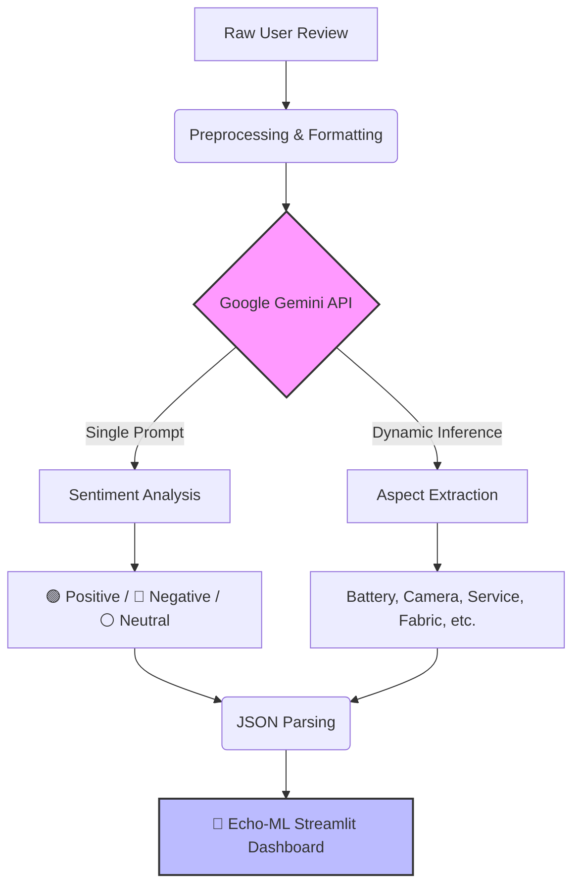

## 🧠 Architecture Flow

```mermaid
graph TD
    A[Raw User Review] --> B(Preprocessing & Formatting)
    B --> C{Google Gemini API}
    
    C -->|Single Prompt| D[Sentiment Analysis]
    C -->|Dynamic Inference| E[Aspect Extraction]
    
    D --> F[🟢 Positive / 🔴 Negative / ⚪ Neutral]
    E --> G[Battery, Camera, Service, Fabric, etc.]
    
    F --> H(JSON Parsing)
    G --> H
    
    H --> I[🚀 Echo-ML Streamlit Dashboard]
    
    style C fill:#f9f,stroke:#333,stroke-width:2px
    style I fill:#bbf,stroke:#333,stroke-width:2px
```
